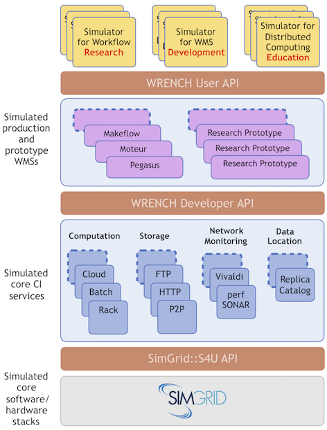

Overview                        {#mainpage}
============

@WRENCHUserDoc 
User Documentation

Other: <a href="../developer/">Developer</a> - <a href="../internal/">Internal</a>
 @endWRENCHDoc
@WRENCHDeveloperDoc  
Developer Documentation

Other: <a href="../user/">User</a> - <a href="../internal/">Internal</a>
 @endWRENCHDoc
@WRENCHInternalDoc  
Internal Documentation

Other: <a href="../user/">User</a> -  <a href="../developer/">Developer</a>
 @endWRENCHDoc

[TOC]

  

[WRENCH](http://wrench-project.org) enables novel avenues for scientific workflow use, 
research, development, and education.
WRENCH capitalizes on recent and critical advances in the state of the art of distributed 
platform/application simulation. WRENCH builds on top
of the open-source [SimGrid](https://simgrid.org) simulation framework. 
SimGrid enables the simulation of large-scale
distributed applications in a way that is accurate (via validated simulation models), scalable 
(low ratio of simulation time to simulated time, ability to run large simulations 
on a single computer with low compute, memory, and energy footprints), and expressive (ability 
to simulate arbitrary platform, application, and execution scenarios).  WRENCH provides directly
usable high-level simulation abstractions using SimGrid as a foundation. 

In a nutshell, WRENCH makes it possible to: 

- Prototype implementations of Workflow Management System (WMS) components and underlying algorithms;
- Quickly, scalably, and accurately simulate arbitrary workflow and platform scenarios for a simulated WMS 
  implementation; and 
- Run extensive experimental campaigns to conclusively compare workflow executions, platform 
  architectures, and WMS algorithms and designs.

 

# Architecture #                        {#overview-architecture}

WRENCH is an _open-source library_ for developing simulators. It is neither a graphical 
interface nor a stand-alone simulator. WRENCH exposes several high-level simulation 
abstractions to provide high-level **building blocks** for developing custom simulators. 

WRENCH comprises four distinct layers:

- **Simulation Core:**  All necessary simulation models and base abstractions (computing, communicating, storing), provided by [SimGrid](https://simgrid.org).
- **Simulated Core CI Services:** abstractions for simulated cyberinfrastructure (CI) components that can be used by a WMS to execute workflows (compute services, storage services, network proximity services, data location services, etc.).
- **Simulated WMS:** simulated WMS implementations (e.g., simulated existing production WMSs, simulated WMS research prototypes).
- **Top-Level Simulation:** a top-level set of abstractions to instantiate and simulate the execution of arbitrary workflows on arbitrary platforms using a particular WMS implementation.

# Three Classes of Users #                       {#overview-users}

WRENCH is intended for three different classes of users:

- **WMS Users**  use WRENCH to simulate workflow executions using already implemented WMS implementations and Core services.
- **WMS Developers/Researchers**  use WRENCH to prototype and evaluate software WMS designs and/or to investigate and evaluate novel algorithms to be implemented in WMSs, or experimented in novel CI (interacting with already implemented Core Services). 
- **Internal Developers** contribute to the WRENCH code, and in particular, implement new Core Services. 

## Three Levels of API Documentation ##              {#overview-users-levels}

The WRENCH library provides three _incremental_ levels of documentation, 
each targeting an API level:

**User:** targets users who want to use WRENCH for simulating the execution of 
scientific workflows in different simulation scenarios, using existing
simulated WMSs already implemented using WRENCH. _Users_ are NOT expected 
to develop new simulation abstractions or algorithms. Instead, they only use available 
simulation components as high-level building blocks to quickly build simulators. These
simulators can be as simple as a single 50-line main() function.
@WRENCHNotUserDoc ([See User Documentation](../user/index.html)) @endWRENCHDoc

**Developer:** targets _WMS developers_ and _WMS researchers_ who work on developing
novel WMS designs and algorithms. In addition to documentation 
for all simulation components provided at the _User_ level, _Developer_ documentation include
detailed documentation for interacting with simulated Core Services.
@WRENCHNotDeveloperDoc ([See Developer Documentation](../developer/index.html)) @endWRENCHDoc

**Internal:** targets those users who want to contribute code to WRENCH. The _internal_ documentation 
provides, in addition to both levels above, detailed documentation for all WRENCH classes
including binders to SimGrid. This is the API needed to, for instance, implement new
Core Services. 
@WRENCHNotInternalDoc ([See Internal Documentation](../internal/index.html)) @endWRENCHDoc

# Get in Touch #                        {#overview-contact}

The main channel to reach the WRENCH team is via the support email: 
[support@wrench-project.org](mailto:support@wrench-project.org?subject=WRENCH Support Contact: Your Topic).

**Bug Report / Feature Request:** our preferred channel to report a bug or request a feature is via  
WRENCH's [Github Issues Track](https://github.com/wrench-project/wrench/issues).
