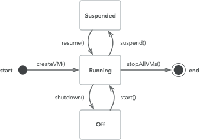

.. _guide-102-cloud:

Interacting with a cloud compute service
========================================

A cloud service provides mechanisms to manage the set of VMs
instantiated on hardware resources. Each VM instance, while it’s
running, exposes its own bare-metal compute service to which :ref:`standard
jobs can be submitted <guide-102-baremetal>`. As a result, one
never submits a job directly to a cloud service.

It is possible to create, shutdown, start, suspend, and resume VMs (see
a complete list of functions available in the
:cpp:class:`wrench::CloudComputeService` API documentation). The figure below
shows the state transition diagram of a VM instance:

Here is an example interaction with a :cpp:class:`wrench::CloudComputeService`:

.. code:: cpp

   std:shared_ptr<wrench::CloudComputeService> some_cloud_cs;

   // Create a VM with 2 cores and 1 GiB of RAM
   auto vm1 = some_cloud_cs->createVM(2, pow(2,30));

   // Create a VM with 4 cores and 2 GiB of RAM
   auto vm2 = some_cloud_cs->createVM(4, pow(2,31));

   // Start both VMs and keep track of their associated bare-metal compute services
   vm1_cs = some_cloud_cs->startVM(vm1);
   vm2_cs = some_cloud_cs->startVM(vm2);

   // Create a job manager
   auto job_manager = this->createJobManager();

   // Create a job
   auto job = job_manager->createStandardJob({... some tasks ...});

   // Submit the job to the 1st VM (i.e., to its bare-metal compute service)
   job_manager->submitJob(job, vm1_cs);

   // Sleep for 10 seconds
   Simulation::sleep(10);

   // Suspend the 1st VM
   some_cloud_cs->suspend(vm1);

   // Sleep for 10 seconds
   Simulation::sleep(10);

   // Resume the 1st VM
   some_cloud_cs->suspend(vm1);

   // Wait for and process the next event (should be a standard job completion or failure)
   this->waitForAndProcessNextEvent();

   // Shutdown both VMs
   some_cloud_cs->shutdown(vm1);
   some_cloud_cs->shutdown(vm2);

Note that the cloud service will decide on which physical resources VM
instances should be started. The underlying physical resources are
completely hidden by the cloud service abstraction. If you want more
control over how the physical resources are used you likely need a
:ref:`virtualized cluster services <guide-102-virtualizedcluster>`.

See the execution controller implementation in
``examples/basic-examples/cloud-bag-of-tasks/TwoTasksAtATimeCloudWMS.cpp``
for a more complete example.
