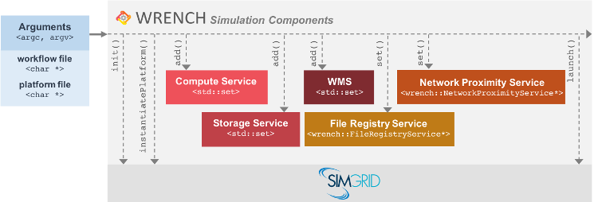

WRENCH 101                        {#wrench-101}
============


<!--
@WRENCHUserDoc <div class="doc-type">User Documentation</div><div class="doc-link">Other: <a href="../developer/wrench-101.html">Developer</a> - <a href="../internal/wrench-101.html">Internal</a></div> @endWRENCHDoc
@WRENCHDeveloperDoc  <div class="doc-type">Developer Documentation</div><div class="doc-link">Other: <a href="../user/wrench-101.html">User</a> - <a href="../internal/wrench-101.html">Internal</a></div> @endWRENCHDoc
@WRENCHInternalDoc  <div class="doc-type">Internal Documentation</div><div class="doc-link">Other: <a href="../user/wrench-101.html">User</a> -  <a href="../developer/wrench-101.html">Developer</a></div> @endWRENCHDoc
-->


<!-- OLD TEXT FROM PREVIOUS GETTING STARTED

## Understanding the Simple Example      {#getting-started-example-simple}

Both versions of the example (cloud of batch) require two command-line arguments: (1) a [SimGrid virtual platform 
description file](https://simgrid.org/doc/latest/platform.html); and
(2) a WRENCH workflow file.

  - **SimGrid simulated platform description file:** 
A [SimGrid](https://simgrid.org) simulation must be provided with the description 
of the platform on which an application execution is to be simulated. This is done via
a platform description file, in XML, that includes definitions of compute hosts, clusters of hosts, 
storage resources, network links, routes between hosts, etc.
A detailed description on how to create a platform description file can be found
[here](https://simgrid.org/doc/latest/platform.html).

  - **WRENCH workflow file:**
WRENCH provides native parsers for [DAX](http://workflowarchive.org) (DAG in XML) 
and [JSON](https://github.com/wrench-project/wrench/tree/master/doc/schemas) workflow description file formats. Refer to 
their respective Web sites for detailed documentation.

The source file for the cloud-based simulator is at `examples/simple-example/SimulatorCloud.cpp`
 and at `examples/simple-example/SimulatorBatch.cpp` for the batch-based example. These source files, which
 are heavily commented, and perform the following:

- The first step is to read and parse the workflow and the platform files, and to
  create a simulation object (`wrench::Simulation`).
- A storage service (`wrench::SimpleStorageService`) is created and deployed on a host.
- A cloud (`wrench::CloudComputeService`) or a batch (`wrench::BatchComputeService`) service is created and
  deployed on a host. Both services are seen by the simulation as compute services
  (`wrench::ComputeService`) – jobs can then be submitted to these services. 
- A Workflow Management System (`wrench::WMS`) is instantiated (in this case the `SimpleWMS`) with a reference to 
  a workflow object (`wrench::Workflow`) and a scheduler (`wrench::Scheduler`). The scheduler implements the
  decision-making algorithms inside the WMS. These algorithms are modularized (so that the same WMS implementation can be iniated
  with various decision-making algorithms in different simulations). The source codes for the schedulers,
  which is of interest to "Developers" (i.e., those users who use the WRENCH Developer API), is in 
  directory `examples/scheduler`. 
- A file registry (`wrench::FileRegistryService`), a.k.a. a file replica catalog, which keeps track of files stored in different storage services, is deployed on a host. 
- Workflow input files are staged on the storage service
- The simulation is launched, executes, and completes.
- Timestamps can be retrieved to analyze the simulated execution.

This simple example can be used as a blueprint for starting a large WRENCH-based
simulation project. The next section provides further details about this process.

-->

This page is meant to provide high-level and detailed information about
what WRENCH simulators can simulate and how they do it. Full API details
are provided in the [User API Reference](../user/annotated.html).  See the
relevant pages for instructions on how to [install WRENCH](@ref install)
and how to [setup a simulator project](@ref getting-started).

[TOC]

---

# 10,000-ft view of a WRENCH simulator #      {#wrench-101-simulator-10000ft}

A WRENCH simulator can be as simple as a single `main()` function that
creates a platform to be simulated (the hardware) and a set of
services that run on the platform (the software).  These services
correspond to software that knows how to store data, perform computation,
and many other useful things that real-world cyberinfrastructure services
can do.

The simulator then creates a workflow (or a set of workflows) to be
executed, which consists of a set of compute tasks each with input and
output files, with control-  and data-dependencies between tasks.

A special service is then created, called a Workflow Management System
(WMS),  that will be in charge of executing the workflow on the platform using
available hardware resources  and software services.  The WMS
is implemented using the [WRENCH Developer](../developer/annotated.html)
and  is discussed  in the [WRENCH 102](@ref wrench-102) page. 

The simulation is then launched via a single call
(```wrench::Simulation::launch()```), and returns only one the WMS has
terminated (typically after completing the execution of the workflow, or
failing to executed it). At that point simulation output can be analyzed
programmatically and/or dumped to a JSON file. This JSON file can be loaded
into the *WRENCH dashboard* tool (just run the ```wrench-dashboard```
executable, which should be installed on your system).


# 1,000-ft view of a WRENCH simulator #         {#wrench-101-simulator-1000ft}

In this section we dive deeper into the main steps that a typical  WRENCH
simulator follows.  To provide context, we refer to the example simulator
in the ```examples/basic-examples/bare-metal-chain``` directory of the
WRENCH distribution. This simulator simulates the execution of a chain
workflow on a two-host platform that runs a bare-metal compute service and
a storage service. Although other examples are available (see
```examples/README.md```), this simple example is sufficient to showcase
most of what a WRENCH simulator does.


-# **Create and initialize a simulation** -- In WRENCH, a user simulation
 is defined via the `wrench::Simulation` class.
 An instance of this class must be created, and the
 `wrench::Simulation::init()` method is called to initialize the simulation
 (and parse WRENCH-specific and
 [SimGrid-specific](https://simgrid.org/doc/latest/Configuring_SimGrid.html)
 command-line arguments).  Two useful such arguments are `--help-wrench`,
 which displays help messages about optional WRENCH-specific command-line
 arguments, and `--help-simgrid`, which displays help messages about
 optional Simgrid-specific command-line arguments.

-# **Instantiate a simulated platform** --  This is done with the `wrench::Simulation::instantiatePlatform()`
 method which takes as argument a 
 [SimGrid virtual platform description file](https://simgrid.org/doc/latest/platform.html).
 Any [SimGrid](https://simgrid.org) simulation must be provided with the description 
 of the platform on which an application/system execution is to be simulated (compute hosts, clusters of hosts, 
 storage resources, network links, routers, routes between hosts, etc.)

-# **Instantiate services on the platform** -- The `wrench::Simulation::add()` method is used
 to add services to the simulation. Each class of service is created with a particular 
 constructor, which also specifies host(s) on which the service is to be started. Typical kinds of services
 include compute services, storage services, network proximity services, and file registry services.  
 
-# **Create at least one workflow** --  This is done by creating an instance of the `wrench::Workflow` class, which has
 methods to manually add tasks and files to the workflow application, but also methods to import workflows
 from standard workflow description files ([DAX](http://workflowarchive.org) and 
 [JSON](https://github.com/workflowhub/workflow-schema)). 
 If there are input files to the workflow's entry tasks, these must be staged on instantiated storage
 services. 
 
-# **Instantiate at least one WMS per workflow** -- At least one of the services instantiated must be a `wrench::WMS` 
 instance, i.e., a service that is in charge of executing the workflow, as implemented by a WRENCH "developer" using 
 the [Developer](../developer/wrench-101.html) API. Associating a workflow to a WMS is done via the 
 `wrench::WMS::addWorkflow()` method.

-# **Launch the simulation** -- This is done via the `wrench::Simulation::launch()` call which first
   sanity checks the simulation setup and then launches all simulated services, until all WMS services
   have exited (after they have completed or failed to complete workflows).
      
-# **Process simulation output** -- The `wrench::Simulation::getOutput()` method returns an object that is a 
  collection of time-stamped traces of simulation events. These traces can be processed/analyzed at will.  
      

<!-- The above steps are depicted in the figure below: 


-->

# Available services #      {#wrench-101-simulator-services}


XXXX MERGE WITH GUIDE CONTENT! XXX

To date, these are the (simulated) services that can be instantiated on the
simulated platform:


- **Compute Services** (classes that derive `wrench::ComputeService`): These are services
  that know how to compute workflow tasks. These include bare-metal servers (`wrench::BareMetalComputeService`), cloud
  platforms (`wrench::CloudComputeService`), virtualized cluster platforms (`wrench::VirtualizedClusterComputeService`),
  batch-scheduled clusters (`wrench::BatchComputeService`).
  It is not technically required to instantiate a compute service, but then no workflow task
  can be executed by the WMS. 

- **Storage Services** (classes that derive `wrench::StorageService`): 
  These are services that know how to store workflow files, which can then be
  accessed in reading/writing by the compute services when executing tasks that
  read/write files. 
  It is not technically required to instantiate a storage service, but then no workflow task
  can have an input or an output file. 

- **File Registry Services** (the `wrench::FileRegistryService` class): 
  These services, often known as _replica catalogs_, are simply
  databases of <filename, list of locations> key-value pairs of the storage services
  on which a copies of files are available.  They are used during workflow execution to decide where
  input files for tasks can be acquired. 
  It is not required to instantiate a file registry service, unless the workflow's
  entry tasks have input files (because in this case these files have to be stored at
  some storage services
  before the execution can start, and all file registry service are then automatically made
  aware of where these files are stored). Note that some WMS implementations
  may complain if no file registry service is available.

- **Network Proximity Services** (the class `wrench::NetworkProximityService`): 
  These are services that monitor the network and maintain a database of 
  host-to-host network distances. This database can be queried by WMSs to make informed
  decisions, e.g., to pick from which storage service a file should be retrieved
  so as to reduce communication time.  Typically, network distances are estimated
  based on round-trip-times between hosts. 
  It is not required to instantiate a network proximity service, but some WMS implementations
  may complain if none is available.

- **Workflow Management Systems (WMSs)** (classes that derive `wrench::WMS`): 
  A workflow management system provides the mechanisms for executing workflow
  applications, include decision-making for optimizing various objectives (the most
  common one is to minimize workflow execution time).  By default,
  WRENCH does not provide a WMS implementation as part of its core components, however a
  simple implementation (`wrench::SimpleWMS`) is available in the `examples/simple-example` folder. Please,
  refer to the [Developer 101 Guide](../developer/wrench-101.html) section for further information
  on how to develop a WMS.  At least **one** WMS should be provided for running a simulation.
  Additional WMSs implementations may also be found in the [WRENCH project website](http://wrench-project.org).


# Customizing Services #         {#wrench-101-customizing-services}

Each service is customizable by passing to its constructor a _property list_, i.e., a key-value map
where each key is a property and each value is a string.  Each service defines a property class.
For instance, the `wrench::Service` class has an associated `wrench::ServiceProperty` class, 
the `wrench::ComputeService` class has an associated `wrench::ComputeServiceProperty` class, and
so on at all levels of the service class hierarchy. 

The API documentation for these property classes explains what each property means, what possible 
values are, and what default values are. Other properties have more to do with what the service 
can or should do when in operation. For instance, the `wrench::BatchComputeServiceProperty` class defines a
`wrench::BatchComputeServiceProperty::BATCH_SCHEDULING_ALGORITHM` which specifies what scheduling algorithm
a batch service should use for prioritizing jobs. All property classes inherit from the 
`wrench::ServiceProperty` class, and one can explore that hierarchy to discover
all possible (and there are many) service customization opportunities. 

Finally, each service exchanges messages on the network with other services (e.g., a WMS service sends 
a "do some work" message to a compute service). The size in bytes, or payload, of all messages can be 
customized similarly to the properties, i.e., by passing a key-value map to the service's constructor. For instance, 
the `wrench::ServiceMessagePayload` class defines a `wrench::ServiceMessagePayload::STOP_DAEMON_MESSAGE_PAYLOAD`
property which can be used to customize the size, in bytes, of the control message sent to the
service daemon (that is the entry point to the service) to tell it to terminate. 
Each service class has a corresponding message payload class, and the API documentation for these
message payload classes details all messages whose payload can be customized. 


# Customizing logging  #        {#wrench-101-logging}

When running a WRENCH simulator you will notice that there is quite a bit of logging output. While logging
output can be useful to inspect visually the way in which the simulation proceeds, it often becomes necessary
to disable it.  WRENCH's logging system is a thin layer on top of SimGrid's logging system, and as such
is controlled via command-line arguments. The simple example in `examples/simple-example` is executed 
as follows, assuming the working directory is `examples/simple-example`:

~~~~~~~~~~~~~{.cpp}
./wrench-simple-example-cloud  platform_files/cloud_hosts.xml workflow_files/genome.dax
~~~~~~~~~~~~~

One first way in which to modify logging is to disable colors, which can be useful to redirect output
to a file, is to use the `--wrench-no-color` command-line option, anywhere in the argument list, for instance:

~~~~~~~~~~~~~{.cpp}
./wrench-simple-example-cloud  --wrench-no-color platform_files/cloud_hosts.xml workflow_files/genome.dax
~~~~~~~~~~~~~

Disabling all logging is done with the SimGrid option `--wrench-no-log`:

~~~~~~~~~~~~~{.cpp}
./wrench-simple-example-cloud  --wrench-no-log platform_files/cloud_hosts.xml workflow_files/genome.dax
~~~~~~~~~~~~~


The above `--wrench-no-log` option is a simple wrapper around the sophisticated Simgrid logging
capabilities (it is equivalent to the Simgrid argument `--log=root.threshold:critical`). 
Details on these capabilities are displayed when passing the
 `--help-logs` command-line argument to your simulator. In a nutshell particular "log categories" 
 can be toggled on and off. Log category names are attached to `*.cpp` files in the 
 WRENCH and SimGrid code. Using the `--help-log-categories` command-line
 argument shows the
entire log category hierarchy. For instance, there is a log category that is called `wms` for the
WMS, i.e., those logging messages in the `wrench:WMS` class and a log category that is called
`simple_wms` for logging message in the `wrench::SimpleWMS` class, which inherits from `wrench::WMS`. 
These messages are thus logging output produced by the WMS in the simple example. They can be enabled
while other messages are disabled as follows: 

~~~~~~~~~~~~~{.cpp}
./wrench-simple-example-cloud   platform_files/cloud_hosts.xml workflow_files/genome.dax --log=root.threshold:critical --log=simple_wms.threshold=debug --log=wms.threshold=debug
~~~~~~~~~~~~~

Use the `--help-logs` option displays information on the way SimGrid logging works. See the 
[full SimGrid logging documentation](https://simgrid.org/doc/latest/outcomes.html) for 
all details.


# Analyzing Simulation Output #   {#wrench-101-simulation-output}

Once the `wrench::Simulation::launch()` method has returned, it is possible to process time-stamped traces
to analyze simulation output. The `wrench::Simulation::getOutput()` method returns an instance of 
`wrench::SimulationOutput`. This object has a templated `wrench::SimulationOutput::getTrace()` method to 
retrieve traces for various information types. For instance, the call
```
simulation.getOutput().getTrace<wrench::SimulationTimestampTaskCompletion>()
```
returns a vector of time-stamped task completion events. The classes that implement time-stamped events
are all classes named `wrench::SimulationTimestampSomething`, where `Something` is pretty self-explanatory
(e.g., `TaskCompletion`).


# Measuring Energy Consumption #                 {#wrench-101-energy}

WRENCH leverages [SimGrid's energy plugin](https://simgrid.org/doc/latest/Plugins.html#host-energy),
which provides accounting for computing time and dissipated energy in the simulated platform. SimGrid's energy plugin 
requires host **pstate** definitions (levels of performance, CPU frequency) in the
[XML platform description file](https://simgrid.org/doc/latest/platform.html). The following is a 
list of current available information provided by the plugin: 

- `wrench::Simulation::getNumberofPstates()`
- `wrench::Simulation::getMinPowerConsumption()`
- `wrench::Simulation::getMaxPowerConsumption()`
- `wrench::Simulation::getListOfPstates()`

**Note:** The energy plugin is NOT enabled by default in WRENCH simulation. To enable the plugin, the 
`--activate-energy` command line option should be provided when running a simulator.


